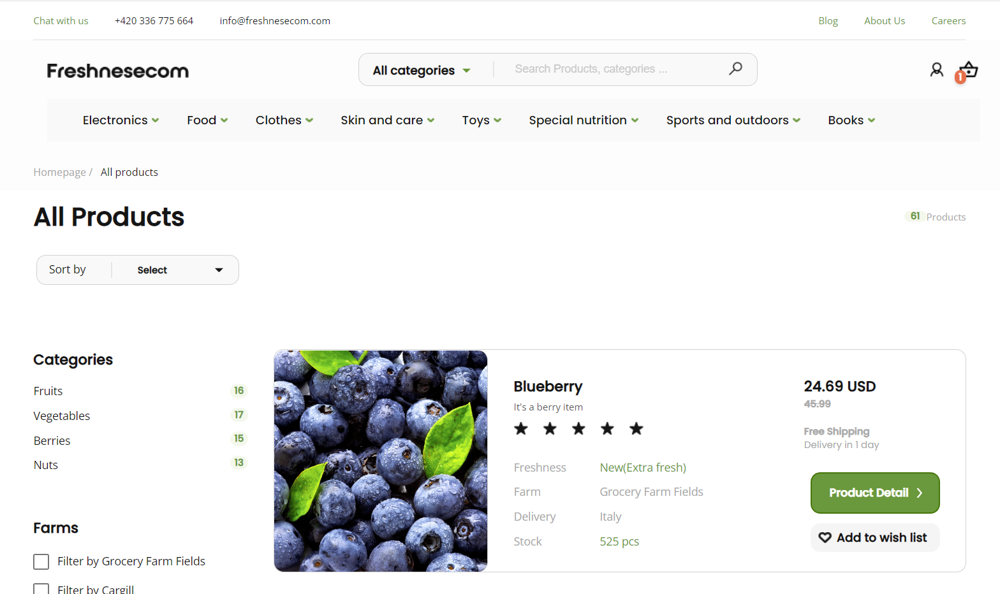
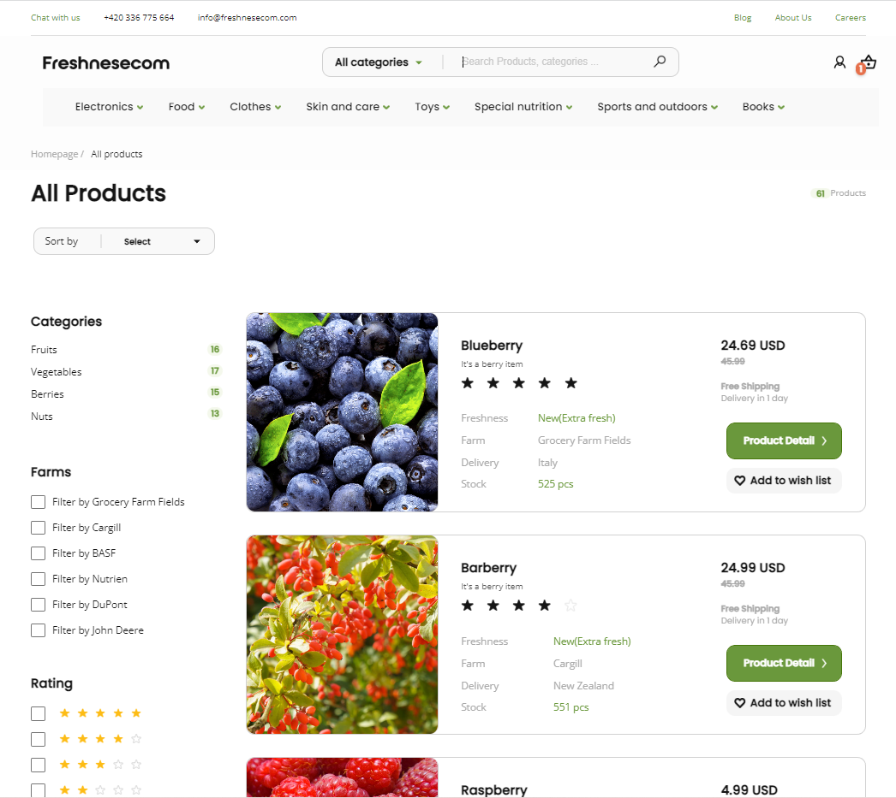
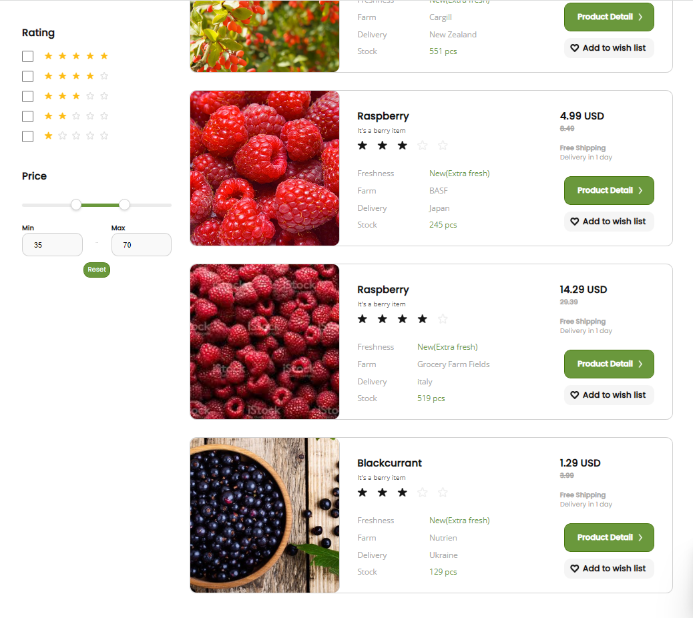
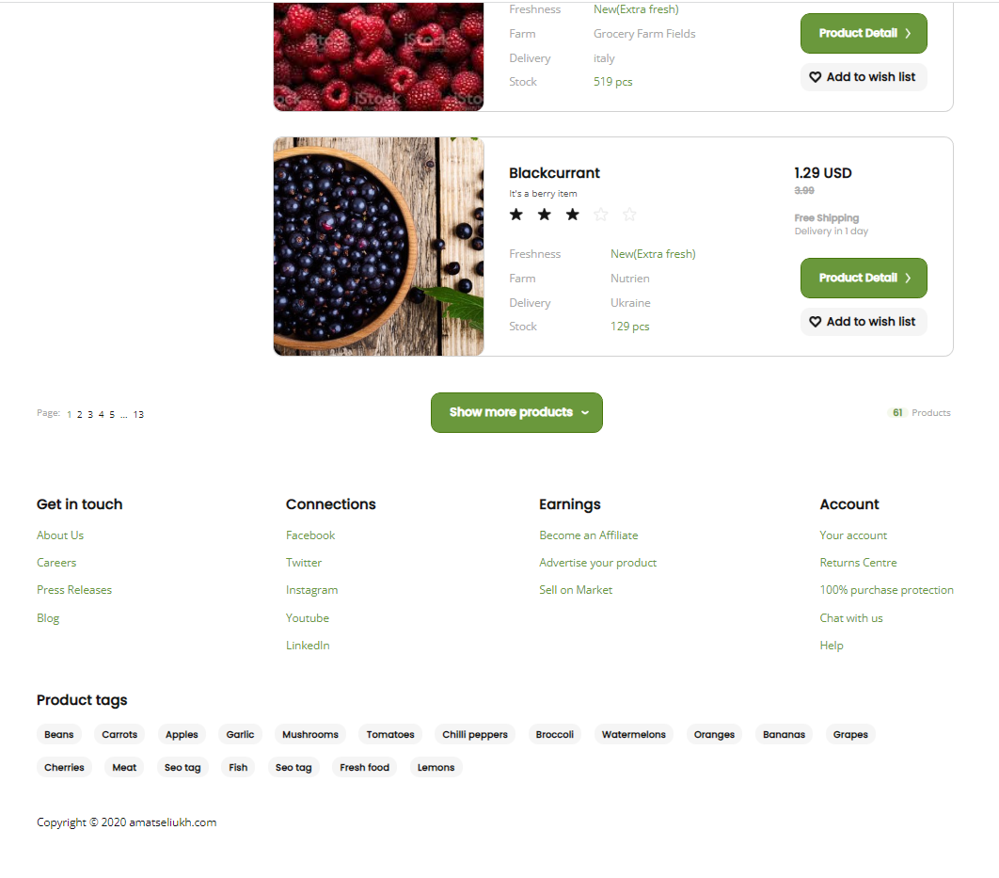
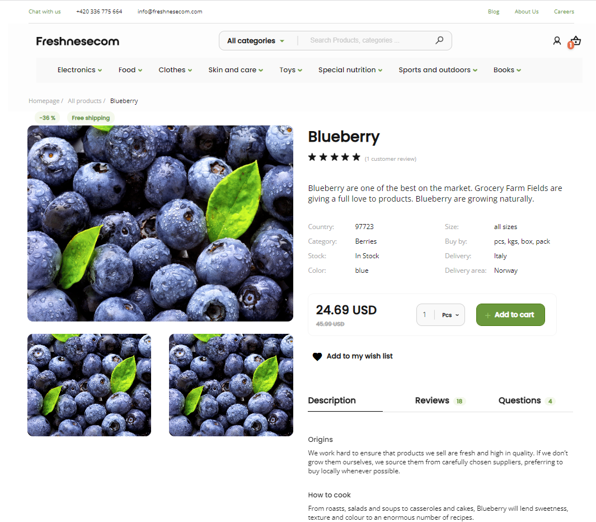
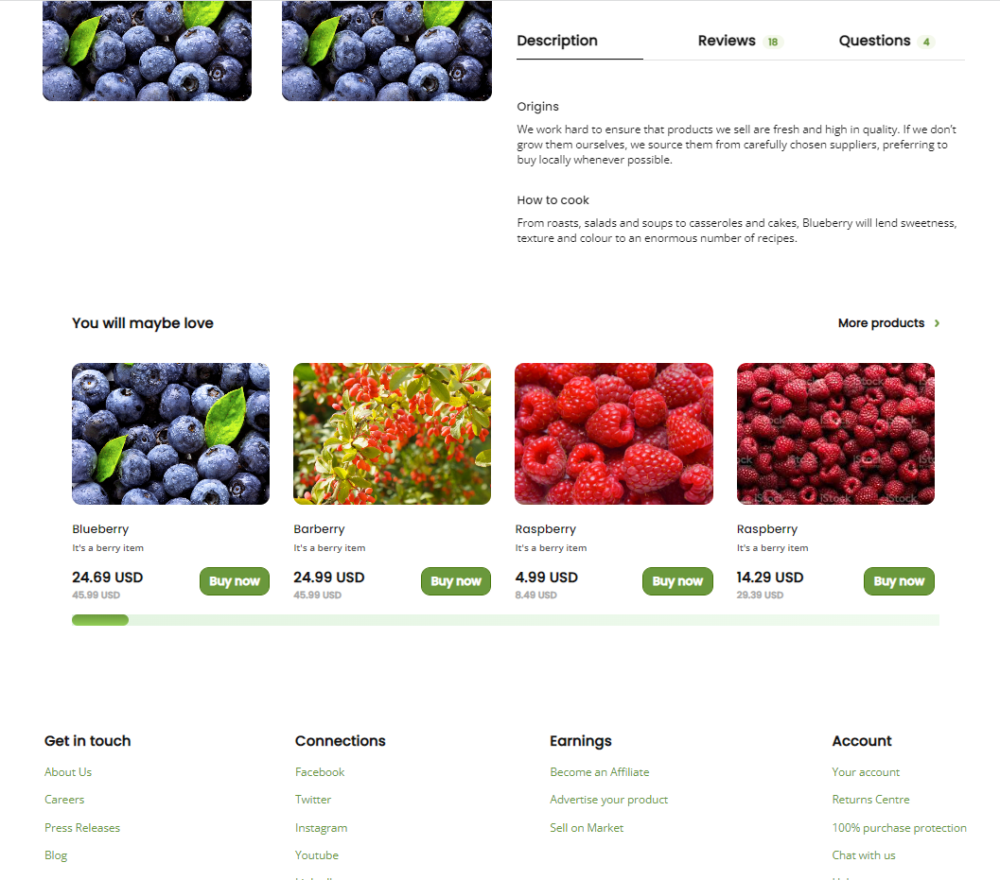
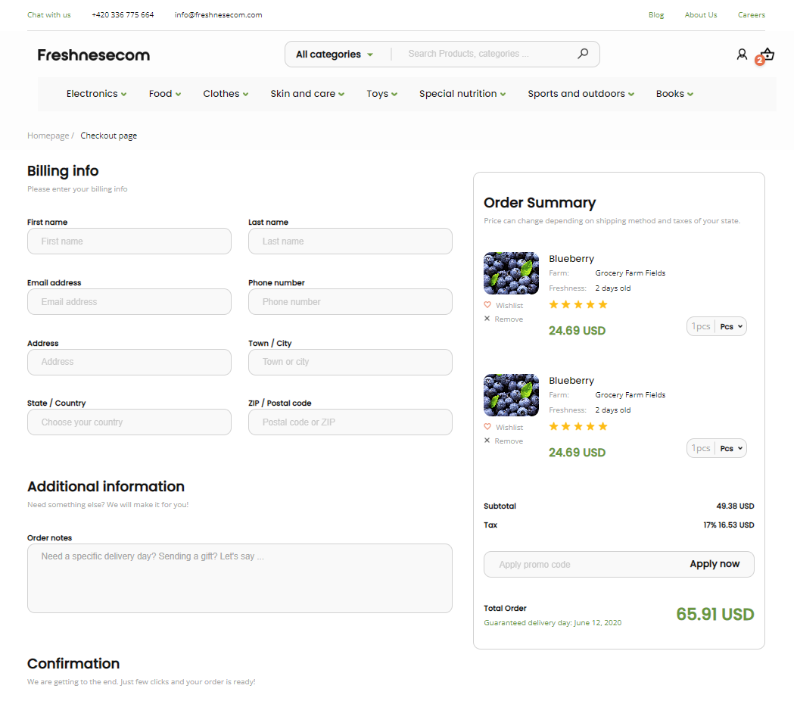
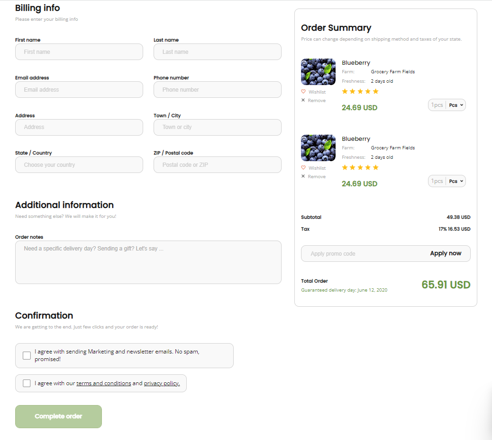
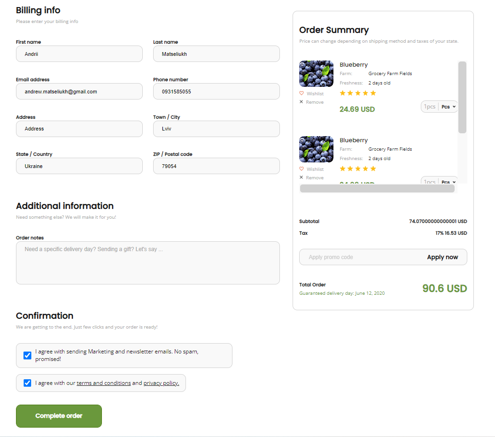

# Angular Internet Store

## Description

This is an Angular Internet Store application powered by an Angular framework and Google Firebase, and Firestore. This
app provides the main functions you'd expect from an internet store web application, such as displaying all products,
filtering these products by different criteria like filtering by categories, distributors, rating, price, and sorting by
rate and price, etc. Available a possibility to navigate to product detail page where you can make an order by filling
out the form , also included adding to cart feature, pagination, slider with related products.

## Screenshots

<!-- If you have screenshots you'd like to share, include them here. -->

## Features

- Ability to filtering products by: categories, farms, rating, price
- Sorting by price, rate
- Added the main search input
- Routing
- Breadcrumbs
- Pagination
- Ability to show more products
- Product detail page with a description of certain product
- Slider that shows more products on product detail page
- Possibility to add products to cart
- Ability to make an order
- Form with input fields validation

## Usage

- Clone this repo to your desktop using `git clone` or download code files
- Run `npm install` to install all the dependencies

## Running application

- Run `npm start` to launch application.
- You will then be able to access it at `localhost:4200`

## Further help

To get more help on the Angular CLI use `ng help` or go check out
the [Angular CLI Overview and Command Reference](https://angular.io/cli) page.
